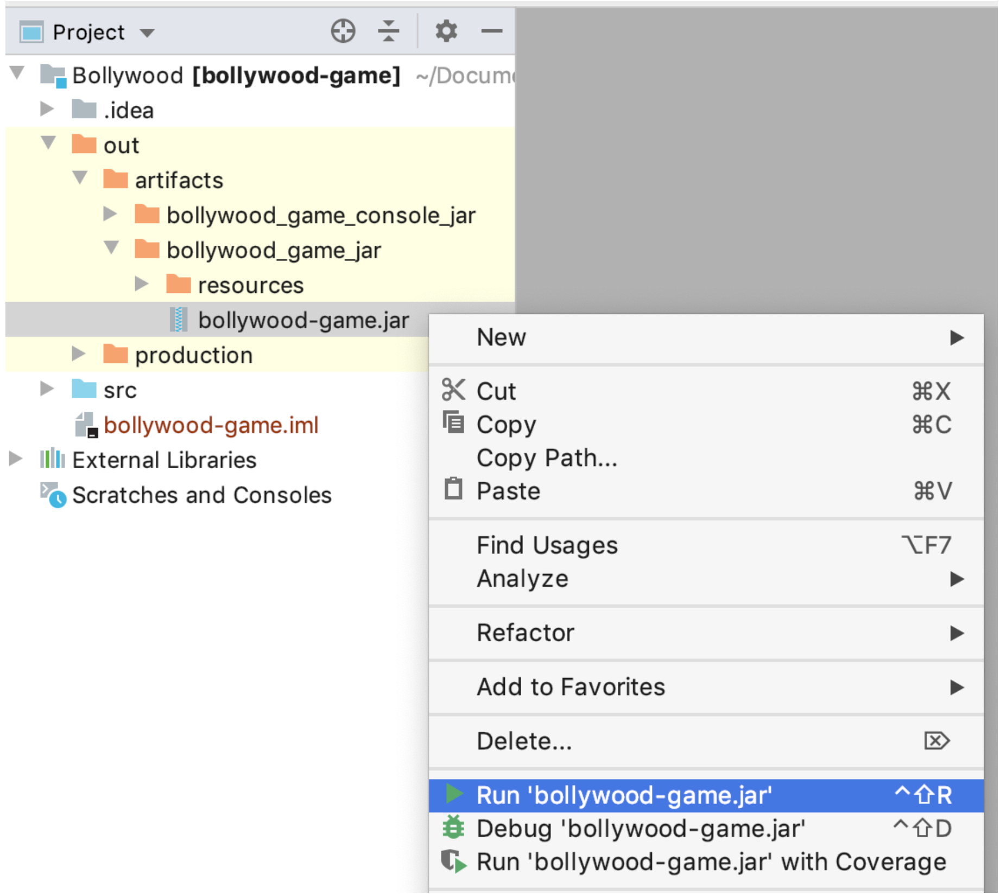

## How to Play Bollywood Game?
***
**Note: The project requires JRE version 6+ on the machine**
***
* Clone the project using following command

        git clone https://github.com/Shail06/bollywood-game.git
   
 * Use following command

CONSOLE VERSION

        cd out/artifacts/bollywood_game_console_jar
        java -jar bollywood-game.jar
        
GUI VERSION

        cd out/artifacts/bollywood_game_console_jar
        java -jar bollywood-game.jar
    
On IntelliJ, Simply Right Click the `bollywood-game.jar` in the respective directory
and `Run` as shown in the below image:

